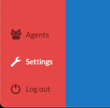
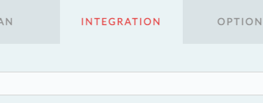
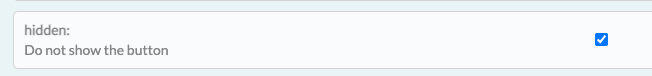
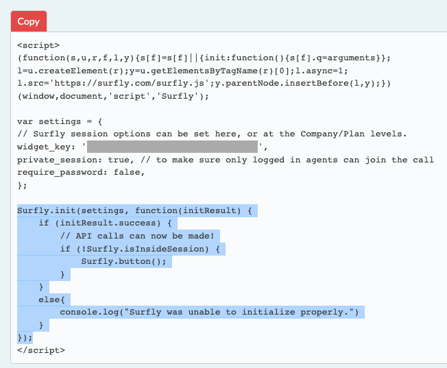
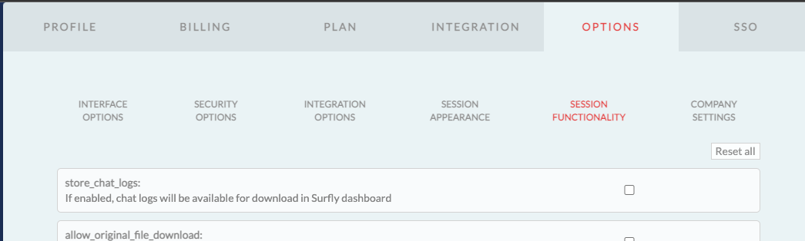
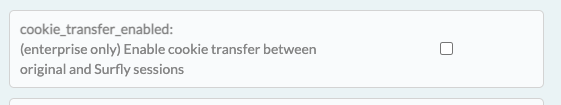
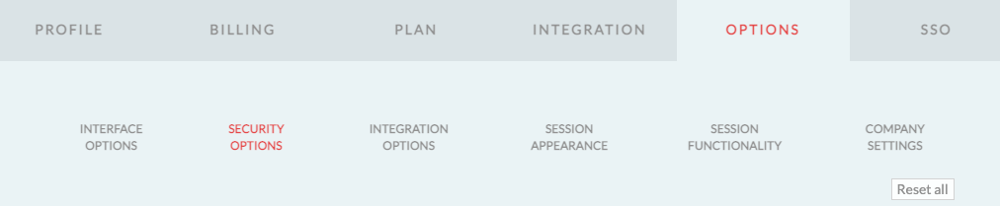
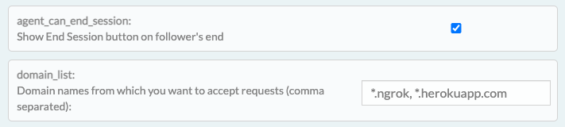

# SURFLY CHATBOT ADAPTER
 
## TABLE OF CONTENTS
* [Description](#description)
* [Functionalities](#functionalities)
* [Installation](#installation)
* [Configuration](#configuration)
    * [Inbenta Messenger configuration](#inbenta-messenger-configuration)
    * [Surfly configuration](#surfly-configuration)
    * [Adapter configuration](#adapter-configuration)
* [Dependencies](#dependencies)
 
## DESCRIPTION
This adapter gives the possibility to cobrowse between Hyperchat agents and Chatbot users, also provides the ability to have video chat, file sharing and anotation options.

You can find a configurated and functional **example of this adapter** in `./example/index.html`.

## FUNCTIONALITIES
Currently, the features provided by this application are:
* Escalate to Hyperchat
* Manage open/close a Cobrowse session.
* Video chat.
* File sharing.
* Go back to Inbenta chatbot once user finishes to talk with an agent.

## INSTALLATION
In order to add this adapter to your SDK, you need to import the files `/src/cobrowse-adapter.js` into your HTML/JS file where you're building the SDK. Then, append it to the SDK adapters array providing the adapter configuration as shown in the [example](#integration-example) section.
More information on how to integrate Inbenta adapters [here](https://developers.inbenta.io/chatbot/javascript-sdk/sdk-adapters).

## CONFIGURATION
This section contains the configuration of 3 components:
* Inbenta Messenger configuration
* Surfly configuration
* Adapter configuration
 
### Inbenta Messenger configuration

In your Inbenta Messenger instance, go to "Messenger &rarr; Settings &rarr; Saved replies" and then click on "**Create a new saved reply**". Add a name (for instance _Cobrowsing_) and in the Text input add exactly this phrase:

```Start cobrowsing```

This will be the trigger to start the Cobrowsing session in user side.

### Surfly configuration

Login into your [Surfly account](#https://app.surfly.com/login/), and then go to "Settings":



Click on "INTEGRATION" tab:



In the **hidden** section, set the tick for "_Do not show the button_", to hide the Surfly button from your web:



Copy the javascript snippet. You need to add this code at the begining of your web (inside ```head``` tag):



> When you paste the code, REMOVE the section of ```Surfly.init(...)``` (the selected part in previous image)

Now, go to the "OPTIONS" tab, and then to the "SESSION FUNCTIONALITY" sub tab:



Uncheck the **cookie_transfer_enabled** tick:



In the same "OPTIONS" tab, now go to "SECURITY OPTIONS" sub tab:



Check the option "_agent_can_end_session_" if you want to have this feature active. Also you can have an extra security layer if you add the allowed domains from which you are using this adapter:



### Adapter configuration

In `./src/chatbot.js` you'll find the needed chatbot configuration. If you are using the chatbot configuration in a different file, make sure the language labels are the same and the order of the adapters is in this way:

```javascript
config.adapters = [
    Cobrowse(config.labels, config.lang),
    SDKNLEscalation2(SDKHCAdapter.checkEscalationConditions),
    SDKHCAdapter.build(),
];
```

And set up the Inbenta variables related to your chatbot instance.

* inbentaKey: This value can be found in the **Administration > API** section in Backstage and is called the API key.
* domainKey: This value can be found in the **Administration > API** section in Backstage and is called the Domain key.

## DEPENDENCIES

This adapter has been developed using Chatbot SDK version **1.50.0**
